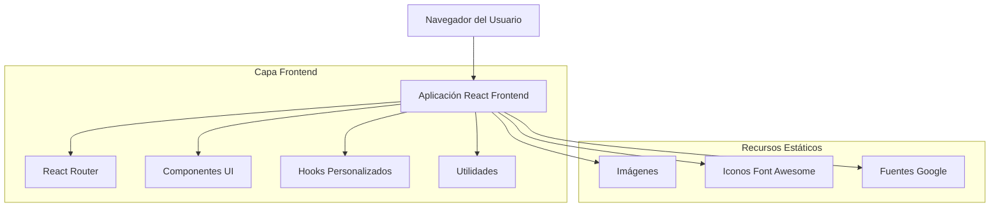

# Documento de Arquitectura Técnica - Migración DRSU a React

## 1. Diseño de Arquitectura



## 2. Descripción de Tecnología

### Frontend Stack
- **React@18** + **TypeScript** - Framework principal
- **Tailwind CSS@3** - Estilos y diseño responsive
- **Vite** - Build tool y desarrollo
- **React Router DOM@6** - Enrutamiento
- **Lucide React** - Librería de iconos (reemplaza Font Awesome)
- **shadcn/ui** - Componentes UI reutilizables
- **Framer Motion** - Animaciones y transiciones
- **clsx** + **tailwind-merge** - Utilidades de clases CSS

### Componentes shadcn/ui Utilizados
- **Button** - Botones interactivos
- **Card** - Tarjetas de contenido
- **Dialog** - Modales y overlays
- **DropdownMenu** - Menús desplegables
- **NavigationMenu** - Navegación principal
- **Sheet** - Sidebar y menús laterales
- **Badge** - Etiquetas y badges
- **Separator** - Divisores visuales

### Backend
- Ninguno (aplicación frontend estática)

## 3. Definiciones de Rutas

| Ruta                               | Propósito                                                        |
| ---------------------------------- | ---------------------------------------------------------------- |
| /                                  | Página principal con todas las secciones principales             |
| /nosotros/que-es-rsu               | Información sobre qué es la Responsabilidad Social Universitaria |
| /nosotros/mision                   | Misión institucional de la DRSU                                  |
| /nosotros/vision                   | Visión institucional de la DRSU                                  |
| /nosotros/ubicacion                | Ubicación física de la DRSU                                      |
| /nosotros/equipo                   | Equipo de trabajo de la DRSU                                     |
| /nosotros/alianzas                 | Alianzas estratégicas institucionales                            |
| /documentos-gestion/reconocimiento | Documentos de reconocimiento institucional                       |
| /documentos-gestion/reglamento     | Reglamento de Responsabilidad Social Universitaria               |
| /documentos-gestion/poi            | Plan Operativo Institucional RSU                                 |
| /documentos-gestion/plan-anual     | Plan Anual de actividades                                        |
| /herramientas/cursos               | Cursos disponibles y recursos educativos                         |
| /herramientas/videos               | Videos educativos y de capacitación                              |
| /herramientas/presentaciones       | Presentaciones y material didáctico                              |
| /actividades/viii-enarsu           | Información del VIII Encuentro Nacional de RSU                   |
| /actividades/actividades-rsu       | Lista de actividades de RSU                                      |
| /actividades/iniciativas-drsu      | Iniciativas de la DRSU                                           |
| /actividades/proyectos-drsu        | Proyectos ejecutados por la DRSU                                 |
| /noticias                          | Lista completa de noticias y eventos                             |
| /noticias/:id                      | Detalle de noticia específica                                    |
| /contacto                          | Información de contacto y formulario                             |

## 4. Estructura de Componentes

### 4.1 Estructura de Directorios Actualizada
```
src/presentation/
├── pages/
│   ├── home/
│   │   ├── index.tsx
│   │   └── components/
│   │       ├── HeroSection.tsx
│   │       ├── WhatWeDoSection.tsx
│   │       ├── VolunteerSection.tsx
│   │       ├── ProjectsSection.tsx
│   │       └── NewsSection.tsx
│   ├── nosotros/
│   │   ├── que-es-rsu/
│   │   │   ├── index.tsx
│   │   │   └── components/
│   │   │       └── RSUDefinition.tsx
│   │   ├── mision/
│   │   │   ├── index.tsx
│   │   │   └── components/
│   │   │       └── MissionContent.tsx
│   │   ├── vision/
│   │   │   ├── index.tsx
│   │   │   └── components/
│   │   │       └── VisionContent.tsx
│   │   ├── equipo/
│   │   │   ├── index.tsx
│   │   │   └── components/
│   │   │       ├── TeamMember.tsx
│   │   │       └── TeamGrid.tsx
│   │   ├── ubicacion/
│   │   │   ├── index.tsx
│   │   │   └── components/
│   │   │       └── LocationMap.tsx
│   │   └── alianzas/
│   │       ├── index.tsx
│   │       └── components/
│   │           └── AllianceCard.tsx
│   ├── actividades/
│   │   ├── actividades-rsu/
│   │   │   ├── index.tsx
│   │   │   └── components/
│   │   │       └── ActivityCard.tsx
│   │   ├── iniciativas-drsu/
│   │   │   ├── index.tsx
│   │   │   └── components/
│   │   │       └── InitiativeCard.tsx
│   │   ├── proyectos-drsu/
│   │   │   ├── index.tsx
│   │   │   └── components/
│   │   │       └── ProjectCard.tsx
│   │   └── viii-enarsu/
│   │       ├── index.tsx
│   │       └── components/
│   │           └── EventDetails.tsx
│   ├── documentos-gestion/
│   │   ├── reconocimiento/
│   │   ├── reglamento/
│   │   ├── poi/
│   │   └── plan-anual/
│   ├── herramientas/
│   │   ├── cursos/
│   │   ├── videos/
│   │   └── presentaciones/
│   ├── noticias/
│   │   ├── index.tsx
│   │   ├── detalle/
│   │   └── components/
│   │       ├── NewsCard.tsx
│   │       ├── NewsGrid.tsx
│   │       └── NewsDetail.tsx
│   └── contacto/
│       ├── index.tsx
│       └── components/
│           ├── ContactForm.tsx
│           └── ContactInfo.tsx
├── components/ (componentes reutilizables globales)
│   ├── ui/ (shadcn/ui components)
│   │   ├── button.tsx
│   │   ├── card.tsx
│   │   ├── dialog.tsx
│   │   ├── dropdown-menu.tsx
│   │   ├── navigation-menu.tsx
│   │   ├── sheet.tsx
│   │   ├── badge.tsx
│   │   └── separator.tsx
│   ├── layout/
│   │   ├── Sidebar.tsx
│   │   ├── MenuOverlay.tsx
│   │   ├── Header.tsx
│   │   └── Layout.tsx
│   └── common/
│       ├── Breadcrumb.tsx
│       ├── FeatureCard.tsx
│       ├── LoadingSpinner.tsx
│       └── ErrorBoundary.tsx
├── hooks/
│   ├── useNavigation.ts
│   ├── useScrollAnimation.ts
│   └── useSidebar.ts
└── lib/
    ├── utils.ts
    ├── types.ts
    └── constants.ts
```

### 4.2 Componentes Reutilizables (src/presentation/components/)

```typescript
// Layout Components
- Header.tsx
- Footer.tsx
- Sidebar.tsx
- MenuOverlay.tsx

// UI Components
- Button.tsx (ya existe)
- Card.tsx
- Badge.tsx
- Modal.tsx
- Breadcrumb.tsx

// Feature Components
- NewsCard.tsx
- ProjectCard.tsx
- VolunteerCard.tsx
- FeatureCard.tsx
- TeamMemberCard.tsx

// Navigation Components
- NavigationMenu.tsx
- DropdownMenu.tsx
- SidebarIcon.tsx
```

### 4.3 Páginas (src/presentation/pages/)

```typescript
// Main Pages
- HomePage.tsx
- NewsPage.tsx
- NewsDetailPage.tsx
- ContactPage.tsx

// Nosotros Pages
- WhatIsRSUPage.tsx
- MissionPage.tsx
- VisionPage.tsx
- LocationPage.tsx
- TeamPage.tsx
- AlliancesPage.tsx

// Documentos Pages
- RecognitionPage.tsx
- RegulationPage.tsx
- POIPage.tsx
- AnnualPlanPage.tsx

// Herramientas Pages
- CoursesPage.tsx
- VideosPage.tsx
- PresentationsPage.tsx

// Actividades Pages
- VIIIENARSUPage.tsx
- RSUActivitiesPage.tsx
- DRSUInitiativesPage.tsx
- DRSUProjectsPage.tsx
```

### 4.3 Hooks Personalizados (src/presentation/hooks/)

```typescript
- useMenuToggle.ts
- useScrollAnimation.ts
- useActiveSection.ts
- useResponsive.ts
```

### 4.4 Utilidades (src/presentation/lib/)

```typescript
- constants.ts
- types.ts
- utils.ts
```

## 5. Modelo de Datos

### 5.1 Definición del Modelo de Datos

```typescript
import { LucideIcon } from 'lucide-react';

// Types for News
interface NewsItem {
  id: string;
  title: string;
  excerpt: string;
  content: string;
  image: string;
  date: Date;
  category: string;
  slug: string;
}

// Types for Projects
interface Project {
  id: string;
  number: string;
  title: string;
  description: string;
  tags: string[];
  category: 'social' | 'environmental' | 'educational' | 'health';
}

// Types for Team Members
interface TeamMember {
  id: string;
  name: string;
  position: string;
  image: string;
  bio?: string;
  email?: string;
}

// Types for Volunteer Programs
interface VolunteerProgram {
  id: string;
  title: string;
  description: string;
  icon: LucideIcon;
  color: 'blue' | 'green' | 'orange' | 'purple' | 'red';
  category: string;
}

// Types for Features
interface Feature {
  id: string;
  title: string;
  icon: LucideIcon;
  items: string[];
  category: 'formation' | 'research' | 'community' | 'management';
}

// Types for Navigation
interface NavigationItem {
  id: string;
  label: string;
  href?: string;
  icon: LucideIcon;
  children?: NavigationItem[];
}

// Types for Courses/Resources
interface Resource {
  id: string;
  title: string;
  description: string;
  thumbnail: string;
  type: 'course' | 'video' | 'presentation';
  url?: string;
  duration?: string;
}
```

### 5.2 Componentes Principales

#### Layout Components
```typescript
import { Home, Lightbulb, Users, FolderOpen, Newspaper } from 'lucide-react';
import { Sheet, SheetContent, SheetTrigger } from '@/components/ui/sheet';
import { NavigationMenu, NavigationMenuItem } from '@/components/ui/navigation-menu';

// Sidebar con iconos Lucide React
interface SidebarProps {
  activeSection: string;
  onSectionChange: (section: string) => void;
}

// Menu overlay usando Sheet de shadcn/ui
interface MenuOverlayProps {
  isOpen: boolean;
  onClose: () => void;
}

// Header con componentes shadcn/ui
interface HeaderProps {
  className?: string;
}
```

#### UI Components con shadcn/ui
```typescript
import { Card, CardContent, CardHeader, CardTitle } from '@/components/ui/card';
import { Button } from '@/components/ui/button';
import { Badge } from '@/components/ui/badge';
import { Separator } from '@/components/ui/separator';

// Card de características usando shadcn/ui Card
interface FeatureCardProps {
  icon: React.ComponentType<{ className?: string }>;
  title: string;
  items: string[];
  delay?: number;
}

// Card de noticias con componentes shadcn/ui
interface NewsCardProps {
  id: string;
  title: string;
  excerpt: string;
  image: string;
  date: string;
  category: string;
}

// Breadcrumb con iconos Lucide
interface BreadcrumbProps {
  items: Array<{
    label: string;
    href?: string;
    active?: boolean;
  }>;
}
```

#### Mapeo de Iconos Font Awesome → Lucide React
```typescript
import {
  Home, Lightbulb, Users, HandHeart, FolderOpen, Newspaper,
  Mail, Phone, MapPin, ChevronDown, ChevronRight, Menu, X,
  Briefcase, Search, Settings, Calendar, User, Eye, Target,
  GraduationCap, Video, Film, Award, Book, ClipboardList,
  CalendarDays, Wrench, CheckSquare, Handshake, HelpCircle,
  Info, UserPlus, Megaphone
} from 'lucide-react';

// Conversión de iconos principales
const iconMapping = {
  'fas fa-home': Home,
  'fas fa-lightbulb': Lightbulb,
  'fas fa-users': Users,
  'fas fa-hands-helping': HandHeart,
  'fas fa-project-diagram': FolderOpen,
  'fas fa-newspaper': Newspaper,
  'fas fa-envelope': Mail,
  'fas fa-phone': Phone,
  'fas fa-map-marker-alt': MapPin,
  'fas fa-chevron-down': ChevronDown,
  'fas fa-chevron-right': ChevronRight,
  'fas fa-bars': Menu,
  'fas fa-times': X,
  'fas fa-briefcase': Briefcase,
  'fas fa-search': Search,
  'fas fa-cog': Settings,
  'fas fa-calendar': Calendar,
  'fas fa-user': User,
  'fas fa-eye': Eye,
  'fas fa-bullseye': Target,
  'fas fa-graduation-cap': GraduationCap,
  'fas fa-video': Video,
  'fas fa-film': Film,
  'fas fa-award': Award,
  'fas fa-book': Book,
  'fas fa-clipboard-list': ClipboardList,
  'fas fa-calendar-alt': CalendarDays,
  'fas fa-tools': Wrench,
  'fas fa-tasks': CheckSquare,
  'fas fa-handshake': Handshake,
  'fas fa-question-circle': HelpCircle,
  'fas fa-info-circle': Info,
  'fas fa-user-plus': UserPlus,
  'fas fa-bullhorn': Megaphone
};
```

### 5.2 Datos Estáticos

Los datos se manejarán como constantes estáticas en archivos TypeScript:

```typescript
// src/presentation/lib/data/
- newsData.ts
- projectsData.ts
- teamData.ts
- volunteerData.ts
- featuresData.ts
- navigationData.ts
- resourcesData.ts
```

## 6. Configuración de Tailwind CSS

### 6.1 Configuración Personalizada

```javascript
// tailwind.config.js
module.exports = {
  content: ['./src/**/*.{js,jsx,ts,tsx}'],
  theme: {
    extend: {
      colors: {
        primary: {
          DEFAULT: '#071A40',
          50: '#E6EBF5',
          100: '#CCD7EB',
          200: '#99AFD7',
          300: '#6687C3',
          400: '#335FAF',
          500: '#071A40',
          600: '#051533',
          700: '#041026',
          800: '#020A19',
          900: '#01050D'
        },
        secondary: {
          DEFAULT: '#0A2A5E',
          50: '#E7ECF6',
          100: '#CFD9ED',
          200: '#9FB3DB',
          300: '#6F8DC9',
          400: '#3F67B7',
          500: '#0A2A5E',
          600: '#08224B',
          700: '#061938',
          800: '#041125',
          900: '#020812'
        },
        accent: {
          DEFAULT: '#1E5EFF',
          50: '#E9F0FF',
          100: '#D3E1FF',
          200: '#A7C3FF',
          300: '#7BA5FF',
          400: '#4F87FF',
          500: '#1E5EFF',
          600: '#0041E6',
          700: '#0031B3',
          800: '#002080',
          900: '#00104D'
        }
      },
      fontFamily: {
        'lato': ['Lato', 'sans-serif']
      },
      spacing: {
        'sidebar': '70px'
      },
      animation: {
        'fade-in': 'fadeIn 0.6s ease-out',
        'fade-in-delay': 'fadeIn 0.6s ease-out 0.3s both',
        'slide-in': 'slideIn 0.4s cubic-bezier(0.68, -0.55, 0.265, 1.55)'
      }
    }
  },
  plugins: []
}
```

## 7. Estructura de Archivos del Proyecto

```
src/
├── presentation/
│   ├── components/
│   │   ├── layout/
│   │   │   ├── Header.tsx
│   │   │   ├── Footer.tsx
│   │   │   ├── Sidebar.tsx
│   │   │   └── MenuOverlay.tsx
│   │   ├── ui/
│   │   │   ├── Button.tsx
│   │   │   ├── Card.tsx
│   │   │   ├── Badge.tsx
│   │   │   └── Modal.tsx
│   │   └── features/
│   │       ├── NewsCard.tsx
│   │       ├── ProjectCard.tsx
│   │       └── VolunteerCard.tsx
│   ├── pages/
│   │   ├── HomePage.tsx
│   │   ├── nosotros/
│   │   ├── documentos-gestion/
│   │   ├── herramientas/
│   │   ├── actividades/
│   │   ├── NewsPage.tsx
│   │   └── ContactPage.tsx
│   ├── hooks/
│   │   ├── useMenuToggle.ts
│   │   └── useScrollAnimation.ts
│   └── lib/
│       ├── constants.ts
│       ├── types.ts
│       ├── utils.ts
│       └── data/
│           ├── newsData.ts
│           └── projectsData.ts
├── assets/
│   └── images/
└── App.tsx
```

## 8. Plan de Migración

### 8.1 Fase 1: Configuración Base

* Configurar Tailwind CSS

* Crear estructura de carpetas

* Configurar React Router

* Migrar assets (imágenes)

### 8.2 Fase 2: Componentes Base

* Crear componentes de layout (Header, Footer, Sidebar)

* Implementar sistema de navegación

* Crear componentes UI reutilizables

### 8.3 Fase 3: Páginas Principales

* Migrar página principal

* Implementar secciones principales

* Crear páginas de contenido estático

### 8.4 Fase 4: Funcionalidades Avanzadas

* Implementar animaciones

* Optimizar responsividad

* Testing y refinamiento

### 8.5 Fase 5: Optimización

* Performance optimization

* SEO improvements

* Accessibility enhancements

