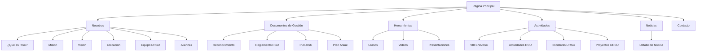

# Documento de Requerimientos del Producto - Migración DRSU a React

## 1. Resumen del Producto

Migración de la aplicación web de la Dirección de Responsabilidad Social Universitaria (DRSU) de la Universidad Nacional de Piura desde HTML/CSS/JavaScript puro hacia una aplicación React moderna con TypeScript y Tailwind CSS. La aplicación actual presenta información institucional, proyectos sociales, noticias y sistema de voluntariado universitario.

El objetivo es modernizar la arquitectura manteniendo toda la funcionalidad existente, mejorando la mantenibilidad del código y preservando la experiencia de usuario actual.

## 2. Características Principales

### 2.1 Roles de Usuario
No se requiere sistema de autenticación. La aplicación es de acceso público para consulta de información institucional.

### 2.2 Módulo de Características

Descripción general de las páginas en los requerimientos:

1. **Página Principal**: Hero section con breadcrumbs, sidebar de navegación, menú overlay, secciones informativas (¿Qué hacemos?, Voluntariado, Proyectos, Noticias), footer institucional.
2. **Páginas de Nosotros**: ¿Qué es RSU?, Misión, Visión, Ubicación, Equipo DRSU, Alianzas Estratégicas.
3. **Páginas de Documentos de Gestión**: Reconocimiento, Reglamento RSU, POI-RSU, Plan Anual.
4. **Páginas de Herramientas**: Cursos, Videos, Presentaciones.
5. **Páginas de Actividades**: VIII ENARSU, Actividades RSU, Iniciativas DRSU, Proyectos DRSU.
6. **Página de Noticias**: Lista de noticias con filtros y paginación.
7. **Página de Detalle de Noticia**: Vista completa de noticia individual.
8. **Página de Contacto**: Información de contacto y formulario.

### 2.3 Detalles de Página

| Nombre de Página | Nombre del Módulo | Descripción de Características |
|------------------|-------------------|-------------------------------|
| Página Principal | Hero Section | Mostrar título principal, breadcrumbs de navegación, imagen de fondo con overlay |
| Página Principal | Sidebar de Navegación | Barra lateral fija con iconos de navegación, tooltips informativos, estado activo |
| Página Principal | Menú Overlay | Menú desplegable con navegación jerárquica, dropdowns anidados, animaciones de transición |
| Página Principal | Sección ¿Qué hacemos? | Cards informativas sobre Formación Profesional, Investigación, Vínculo con el entorno, Gestión Institucional |
| Página Principal | Sección Voluntariado | Cards de tipos de voluntariado con iconos coloridos y descripciones |
| Página Principal | Sección Proyectos | Cards numeradas de proyectos sociales con tags categorizados |
| Página Principal | Sección Noticias | Grid de noticias con imágenes, fechas, títulos y enlaces |
| Página Principal | Universidad Saludable | Sección especial con pilares de salud (nutricional, mental, física) |
| Página Principal | Footer | Información de contacto, enlaces rápidos, transparencia, redes sociales |
| Páginas Nosotros | Contenido Informativo | Mostrar información específica de cada sección con layout consistente |
| Páginas Documentos | Visualización de Documentos | Presentar documentos de gestión con enlaces de descarga |
| Páginas Herramientas | Recursos Educativos | Mostrar cursos, videos y presentaciones con thumbnails y descripciones |
| Páginas Actividades | Eventos y Actividades | Listar actividades académicas y proyectos con detalles |
| Página Noticias | Lista de Noticias | Grid responsive de noticias con filtros por fecha y categoría |
| Página Detalle Noticia | Contenido Completo | Mostrar noticia completa con imágenes, fecha, contenido y navegación |
| Página Contacto | Información de Contacto | Mostrar datos de contacto, mapa de ubicación y formulario de contacto |

## 3. Proceso Principal

**Flujo de Navegación del Usuario:**

El usuario accede a la página principal donde puede navegar a través del sidebar de iconos o el menú overlay desplegable. Desde la página principal puede acceder a cualquier sección específica (Nosotros, Documentos, Herramientas, Actividades) o ver noticias individuales. El sistema mantiene la navegación consistente en todas las páginas.

## 4. Diseño de Interfaz de Usuario

### 4.1 Design Style

**Paleta de Colores:**
- Primary: #071A40 (azul marino institucional)
- Secondary: #0A2A5E (azul secundario)
- Accent: #1E5EFF (azul brillante para CTAs)
- Success: #28A745 (verde para estados positivos)
- Warning: #FFC107 (amarillo para alertas)
- Danger: #DC3545 (rojo para errores)
- Dark: #262627 (texto principal)
- Light: #F8F9FA (fondos claros)
- White: #FFFFFF (fondo principal)

**Tipografía:**
- Font Family: 'Lato' (Google Fonts)
- Pesos: 300 (light), 400 (regular), 700 (bold), 900 (black)
- Tamaños principales: text-sm, text-base, text-lg, text-xl, text-2xl, text-3xl

**Estilo de Componentes:**
- Botones: Redondeados (rounded-lg) con efectos hover y transiciones suaves
- Cards: Sombras sutiles (shadow-lg) con bordes redondeados
- Iconos: **Lucide React** - estilo minimalista y consistente
- Layout: Sidebar fijo + contenido principal responsive

**Componentes shadcn/ui:**
- Button variants: default, destructive, outline, secondary, ghost, link
- Card con header, content y footer
- Dialog para modales y overlays
- DropdownMenu para navegación jerárquica
- Sheet para sidebar móvil

### 4.2 Resumen de Diseño de Página

| Page Name | Module Name | UI Elements |
|-----------|-------------|-------------|
| Home | Hero Section | Gradient background (#071A40 to #0A2A5E), Breadcrumb con Lucide ChevronRight, título h1 con animación fade-in, Button shadcn/ui variant="default" |
| Home | Sidebar | Fixed left sidebar (70px), Lucide icons (Home, Lightbulb, Users, FolderOpen, Newspaper), Sheet component para móvil |
| Home | Menu Overlay | Dialog component, DropdownMenu anidados, NavigationMenu con Lucide ChevronDown/ChevronRight |
| Home | Feature Cards | Card shadcn/ui con shadow-lg, Lucide icons (Briefcase, Search, Users, Settings), hover effects |
| Nosotros | Content Sections | Card layouts, Separator components, Badge para categorías, responsive grid |
| Noticias | News Grid | Card grid responsive, Lucide Calendar/User icons, Button "Leer más" |
| Contacto | Contact Form | Input fields, Button submit, Lucide Mail/Phone/MapPin icons |

### 4.3 Responsividad

La aplicación debe ser completamente responsive con enfoque mobile-first:
- **Desktop**: Sidebar visible, menú overlay como alternativa
- **Tablet**: Sidebar colapsado, menú overlay principal
- **Mobile**: Solo menú overlay, cards en columna única, texto optimizado

Optimización para interacción táctil en dispositivos móviles con botones de tamaño adecuado y navegación simplificada.